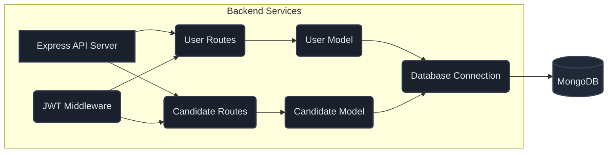
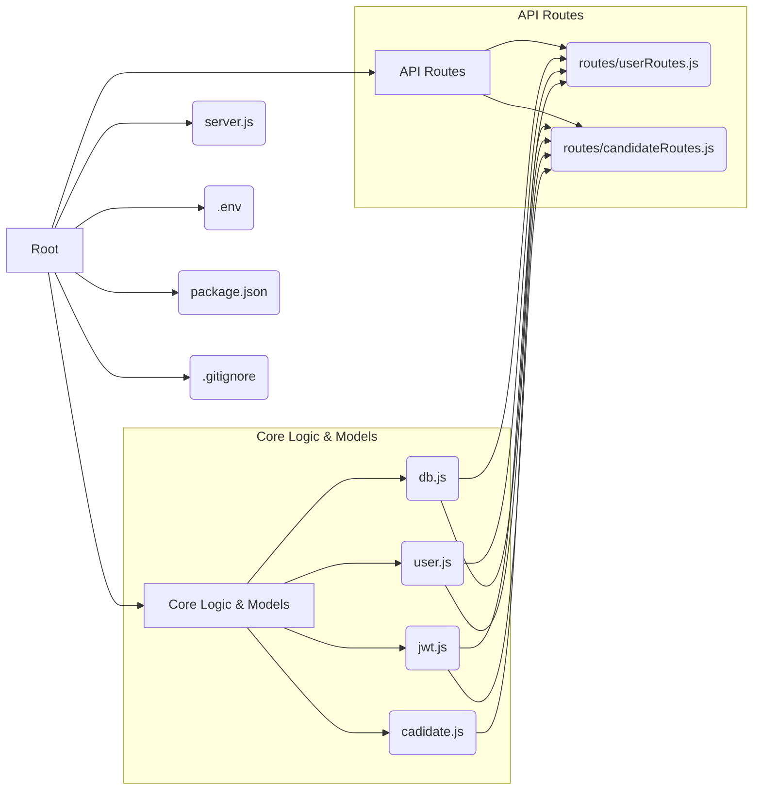

# Voting App: Introduction

The Voting App is a backend service designed to manage and facilitate electronic elections. It provides a robust and secure platform for registering candidates, allowing authenticated users to cast their votes, and tracking election results. This system is built with Node.js, Express.js, and MongoDB, leveraging Mongoose for Object Data Modeling (ODM).

## Purpose and Role

The primary purpose of the Voting App is to streamline the election process by:

*   **Candidate Management:** Allowing administrators to add, update, and remove candidates from an election.
*   **User Authentication:** Securing the voting process through user registration and authentication, ensuring only eligible voters can participate.
*   **Vote Casting:** Enabling authenticated users to cast a single vote for their preferred candidate.
*   **Result Aggregation:** Tallying votes and providing real-time or aggregated results.

The application acts as the central authority for election data, ensuring data integrity and preventing fraudulent activities.

## Core Components

The Voting App is composed of several key modules that work in conjunction:

*   **User Management (`user.js`, `routes/userRoutes.js`):** Handles user registration, authentication, and role management (voter/admin). It stores user credentials, profile information, and tracks voting status.
*   **Candidate Management (`cadidate.js`, `routes/candidateRoutes.js`):** Manages candidate information, including name, party, and vote counts.
*   **Database Interaction (`db.js`):** Establishes and manages the connection to the MongoDB database using Mongoose.
*   **Authentication and Authorization (`jwt.js`):** Implements JSON Web Token (JWT) based authentication to secure API endpoints and verify user identities. It also enforces role-based access control.
*   **API Endpoints (`server.js`, `routes/*`):** Exposes RESTful API endpoints for interacting with the application's functionalities.

## System Architecture Overview

The Voting App follows a typical client-server architecture. The Node.js/Express.js backend serves as the API layer, interacting with a MongoDB database for persistent storage.

## Key Concepts and Data Models

### User Model (`user.js`)

The `User` model represents an individual participating in the election.

*   **`name`**: Full name of the user.
*   **`age`**: Age of the user.
*   **`mobile`**: Mobile number, used as a unique identifier.
*   **`email`**: Email address, also a unique identifier.
*   **`aadharCardNumber`**: Aadhaar card number, a mandatory unique identifier for voters.
*   **`password`**: Hashed password for authentication.
*   **`role`**: User's role, restricted to `'voter'` or `'admin'`. Admins have elevated privileges for managing candidates.
*   **`isVoted`**: A boolean flag indicating whether the user has already cast their vote. This prevents duplicate voting.

**Password Hashing:** The `userSchema.pre('save', ...)` hook ensures that passwords are automatically hashed using bcrypt before being stored in the database. This is a critical security measure.

**Password Comparison:** The `userSchema.methods.comparePassword` method provides a secure way to verify a user's password against the stored hash during login.

### Candidate Model (`cadidate.js`)

The `Candidate` model represents an individual running for election.

*   **`name`**: Full name of the candidate.
*   **`party`**: Political party the candidate belongs to.
*   **`age`**: Age of the candidate.
*   **`votes`**: An array of objects, where each object records a user's vote for this candidate. It includes the `user` ID and the `votedAt` timestamp.
*   **`voteCount`**: An integer representing the total number of votes received by the candidate.

## Integration Points

### Database (`db.js`)

The application relies on a MongoDB instance for data persistence. The `db.js` file handles the connection and provides event listeners for connection status.

*   **Connection URL:** The `mongoURL` is configured via environment variables (`process.env.LOCAL_DB_URL` or `process.env.DB_URL`). Ensure the correct URL is set for your environment.
*   **Error Handling:** The connection events (`connected`, `error`, `disconnected`) are logged to the console, aiding in debugging connection issues.

### Authentication (`jwt.js`)

JWT is used for stateless authentication.

*   **`jAuthmiddleware`**: This middleware protects routes by verifying the presence and validity of a `Bearer` token in the `Authorization` header. It decodes the token and attaches user information (`req.user`) to the request object.
*   **`generateToken`**: This function creates JWTs for authenticated users, typically containing their `id` and an expiration time.

**Usage Pattern:** The `jAuthmiddleware` should be applied to any route that requires user authentication.

### Routing (`server.js`, `routes/*`)

The `server.js` file sets up the Express application and mounts the route handlers for users and candidates.

*   **`/user`**: Routes for user-related operations (signup, login, profile management).
*   **`/candidate`**: Routes for candidate management and voting operations.

## Best Practices and Usage Patterns

### Role-Based Access Control (RBAC)

*   **Admin Privileges:** Routes for creating, updating, and deleting candidates (`POST /candidate`, `PUT /candidate/:candidateID`, `DELETE /candidate/:candidateID`) are protected by an `checkAdminRole` function. This ensures only users with the `'admin'` role can perform these actions.
*   **Voter Privileges:** Voting (`POST /candidate/vote/:candidateID`) is restricted to authenticated users who are not admins and have not already voted (`user.isVoted` flag).

### Secure Voting

*   **Single Vote per User:** The `isVoted` flag on the `User` model is crucial for enforcing that each user can only vote once. This flag is set to `true` after a successful vote.
*   **Token-Based Authentication:** JWTs ensure that only authenticated users can access voting functionalities.

### API Design

*   **RESTful Principles:** The API follows RESTful conventions for resource management (e.g., `POST` for creation, `GET` for retrieval, `PUT` for updates, `DELETE` for removal).
*   **Consistent Error Handling:** API responses include appropriate HTTP status codes and JSON error messages for clarity.

## Common Pitfalls and Gotchas

### Environment Variable Management

*   **`dotenv`:** The application uses `dotenv` to load environment variables. Ensure that a `.env` file exists in the project root and contains necessary variables like `PORT`, `JWT_SECRET`, and database connection URLs.
*   **Database URL:** Incorrectly configured database URLs will prevent the application from connecting to MongoDB, leading to startup failures or runtime errors.

### JWT Secret Management

*   **`JWT_SECRET`:** The `JWT_SECRET` is critical for signing and verifying tokens. It should be a strong, randomly generated string and kept confidential. Never commit it directly into version control.

### Input Validation

*   While Mongoose provides schema validation, robust input validation on request bodies is recommended for production environments to prevent unexpected data types or malicious inputs.

### Asynchronous Operations

*   All database operations and JWT operations are asynchronous. Ensure proper use of `async/await` or Promises to handle these operations correctly and avoid race conditions or unhandled rejections.

### Admin Role Enforcement

*   The `checkAdminRole` function relies on fetching user data from the database. Ensure the user ID from the token is correctly used to find the user and verify their role.

This documentation provides a foundational understanding of the Voting App's architecture and functionality. Refer to individual module files for detailed implementation specifics.

# File Structure

This document outlines the directory and file organization of the Voting-App repository, providing a clear understanding of the project's architecture and the purpose of key components. This structure is designed for maintainability and scalability, allowing engineers to quickly locate and modify relevant code.

## Project Root

The root directory contains essential configuration files and the main application entry point.

*   `package.json`: Defines project dependencies, scripts, and metadata.
*   `server.js`: The primary entry point for the application. It initializes the Express server, sets up middleware, connects to the database, and defines API routes.
*   `.env`: Environment variables file (should not be committed to version control). Contains sensitive information like database connection strings and JWT secrets.
*   `.gitignore`: Specifies intentionally untracked files that Git should ignore.

## Core Logic and Models

This directory houses the core business logic, database models, and utility functions.

*   `db.js`: Manages the MongoDB connection using Mongoose. It establishes the connection, handles connection events (connected, error, disconnected), and exports the Mongoose connection object.
    *   **Integration:** This file is imported and used by `server.js` to ensure the database is available before the server starts listening.
    *   **Best Practice:** Centralizing database connection logic here simplifies connection management and error handling.
*   `user.js`: Defines the Mongoose schema and model for `User` entities. It includes user properties, role enumeration, password hashing using bcrypt, and a method for comparing passwords.
    *   **Integration:** Used by `userRoutes.js` for user-related operations and by `candidateRoutes.js` to check user roles and voting status.
    *   **Security Note:** The `pre('save')` hook ensures passwords are automatically hashed before being stored, preventing plain-text password storage.
*   `cadidate.js`: Defines the Mongoose schema and model for `Candidate` entities. It includes candidate details and a sub-document array to track votes cast by users.
    *   **Integration:** Used by `candidateRoutes.js` for managing candidate data and vote recording.
*   `jwt.js`: Contains functions for JSON Web Token (JWT) generation and middleware for authentication.
    *   `generateToken(userData)`: Creates a JWT for a given user payload.
    *   `jAuthmiddleware(req, res, next)`: A middleware function that verifies JWTs from the `Authorization` header. It decodes the token, attaches user information to `req.user`, and proceeds to the next middleware or route handler.
    *   **Integration:** Used by both `userRoutes.js` and `candidateRoutes.js` to protect routes and authenticate users.
    *   **Usage Pattern:** Include `jAuthmiddleware` in route definitions to enforce authentication.

## API Routes

This directory organizes the application's API endpoints, separating concerns for user and candidate management.

*   `routes/userRoutes.js`: Defines API endpoints for user-related operations.
    *   `/signup`: Handles user registration.
    *   `/login`: Handles user authentication and JWT generation.
    *   `/profile`: Retrieves user profile information (requires authentication).
    *   `/profile/password`: Updates user password (requires authentication).
    *   `/`: Retrieves all users (requires authentication).
    *   **Integration:** Imports `User` model and `jwt.js` for authentication and token generation.
*   `routes/candidateRoutes.js`: Defines API endpoints for candidate and voting operations.
    *   `/`: Creates a new candidate (requires admin role).
    *   `/:candidateID`: Updates an existing candidate (requires admin role).
    *   `/:candidateID`: Deletes a candidate (requires admin role).
    *   `/vote/:candidateID`: Records a vote for a specific candidate (requires authentication, checks for admin role and if user has already voted).
    *   `/vote/count`: Retrieves vote counts for all candidates, sorted by count.
    *   `/`: Retrieves a list of all candidates (name and party).
    *   **Integration:** Imports `Candidate` model, `User` model, and `jwt.js` for authentication and authorization.
    *   **Authorization Logic:** Includes a `checkAdminRole` helper function to enforce administrative privileges for certain operations.

## Directory Structure Summary

This structure promotes a clear separation of concerns, making it easier to understand the flow of data and logic within the Voting-App. Engineers can navigate the codebase with confidence, knowing where to find specific functionalities and how different modules interact.
